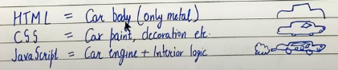

# HTML Tutorials (hypertext markup language)

## HTML-> Hyper Text Markup Language
it is use to create website.
- Agr link chaiye toh HTML tag ke through specify karna padhega ki yahan link chaiye.
- Agr image chaiye toh HTML tag ke through specify karna padhega ki yahan image chaiye.
- Agr paragraph chaiye toh HTML tag ke through specify karna padhega ki yahan paragraph chaiye.

## If HTML does everything then What CSS and Javascipt use for?
HTML -> page ke layout ko define karne ke liye hai, kuj design add nion hai koi style add ni a.
if we remove stylesheet from web page you can see how only HTML looks.

CSS -> konsa button kidr hoga, konse button pe kya desgin hoga or kya chees kidr hogi.
you can change color in css.

Javascript -> to program logic for the page layout. kya chees ko click krne pe kese ho kab ho.
you can control color of css in javascript.

# create a website.

## Chapter 1

1. Why we used index.html > it is a speacial name hota file ka jo apke webserver ko batata ki jab bhi koi apke website pe jaye toh index.html vala page present ho.

2. In index.html > when you do ! the options came out of emmet abbreviation.
what is *emmet abriviation*? jo hame madad krta html, css likhne men.

3. when you turn on live server of index.html and go to browser > you will see display of index.html, check ip address "http://127.0.0.1:5500/index.html" and if you remove /index.html from ip address "http://127.0.0.1:5500" then also it will display index.html.

-OR-

if you change rename index.html to asdfasd.html > now you go to "http://127.0.0.1:5500" and then server will ask which file to show because earlier we have index.html and server was showing that but now we don't have so it is asking.

4. there are two types of tags in html > 
a. [Normal tags] which once open and then you have to close. tag ek vo container hota content jisme ya text hota ya html hota. tags having content in it are html elements and tags whch have no content are empty elements.
*content can be more open and closing tags ya fir text*
like= body tag has more tags and content.
      h1 tag only hhas content which is "this is heading"
b. [Empty tags] which you don't need to close.

5. HTML document > browser > render the code(in viewable form). this process is also called parsing.

6. Head and Body tags are children of HTML tag.

7. We can use .htm or .html extension. disclaimer - if you used index.htm then server will not detect it.

8. Tag is "h1" ya fir "/h1".

9. Element is "<h1>Hello World</h1>". start tag + content + end tag.
*content can be more open and closing tags ya fir text*

10. It is case insensitive language. that mean we can use capital and non capital both.

## Chapter 2

1. We have seen example of HTML Elements.
like body.../body and h1.../h1.

2. Now what is HTML Attributes? href, class, id etc.= sometime we need to supply more information with tags.
when we use anchor tag in vscode by a. it automatically create html attributed. it will ask konse URL me leke jana hai click on text and go to url. 
Attributes= href is attribute here and we can add more attribute like= class, id.

3. What is anchor tag? '<a href="">content</a>'.
anchor tag is used to add links to existing content inside an html page.

This is Absolute url = '<a href="https://codewithharry.com">click here to go to harry website</a>'.
This is Relative url = '<a href="/about.html">go to about</a>'.

4. What is image tags? '' it is empty tag because doesn't need closing tag.
we use image tags to add images in html page and we use alt in it to show if image doesn't load.

5. How to bold, italic, underline?
"<b>this is bold</b>"
"<i>this is italic</i>"
"<u>this is underline</u>"

6. Html ignores new lines and extra spaces in html code.
a. to create new line we will use = br > this is an empty tag.

7. we can use big or small tags. used for big and small fonts.

8. create horizontal lines to seprate them.

9. create subscript (add text in feet) and superscript (add text on head).

10. we want text to display as it is we want (because html ignores extra spaces and new lines).
then we will use pre tags.

## Chapter 3 (creating page layout of SEO friendly)

1. Idely website esi hoti hai.
{header
main
footer}
why we using this format because robot will check in this format that hat is your main content.
footer and header is not that much important but main part is important.

2. In header we add nav tag.

3. In main we add 
section = user ko jo particular part page ka dispay krana chahte ho.
article = particular baat likhi hai page ki
aside = vo ayega jo apke page ke content se hatke hai (like ads)

4. what is div tag? it is used as container for other element.

5. what is inline element and block element?
inline element which take space which required and others can also take the free space.
block elemnt which take whole space in that line.
like= p,div are block elemnt / span is inline element.

## Chapter 4 (lists, tables and forms)

1. lists are use to display content which represent in list.
ul =make unorder list.
ol =make order list

2. tables tag is use to define table in html.
caption = what table is about.
tr = table row
td = table data
th = table headers

thead = it is used to wrap table head and caption.

3. what is Html form? it is use to collect input from user.
form
--element of form--
/form
there are different form element for different kind of form element.
input element= it can be type text, checkbox, radio, button, submit.
texterea element= multi line text.
select elemnt= it is drop down list.

4. what is id and classes in element? 
in element we can define classes and id. the importance of it will get know in css tutorial.
id= it must be unique for each element. it like rollnumber.
classes= it can be same for all elements and can be more than one. its like house in school.

5. what is value and name in element?
they both use in server language.

6. what is iframe tag? it bring other website to your page.

7. what is video tag? we can use our own video.

## Chapter 5 (SEO)

1. Types of SEO
On page SEO = done by developer
Off page SEO = link building, giving link to third party websites.

2. set title very nice and to the pont.

3. set meta description.

4. set a nice url slug.

5. set the meta keywords tags.

6. set meta author tag.

7. set a favicon.

8. compress images and other resources.

9. minify or compress hs, css.

10. add alt text to images.